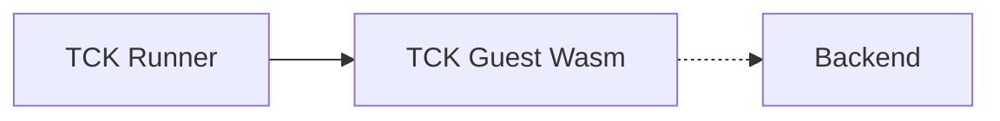

# http-wasm technology compatibility kit (TCK)

The TCK is a test suite for checking conformance of http-wasm implementations
versus the http-wasm [ABI specification][1].

It consists of a guest Wasm binary and a test runner which issues HTTP requests
to a given endpoint. The requests drive different test cases implemented in
the Wasm binary, and the runner verifies that the resulting response from the
endpoint matches expectations for that binary.

## Running the TCK

The TCK is implemented using Go's standard testing framework, so it can be
loaded as a package for Go hosts. A TCK [standalone runner][8] is also provided
for use with Non-Go hosts, or Go hosts that would like to run the TCK outside
the standard testing framework.

The basic steps for running the TCK are

1. Implement the backend handler, which is the business logic wrapped by
middleware
2. Set up the middleware using the TCK guest Wasm module
3. Start an HTTP server serving this middleware
4. Run the tests, pointing at the URL for the HTTP server

The general flow of the HTTP request looks like the follows. Depending on the
test case, the guest Wasm may or may not pass the request to the backend.

We provide an implementation of the backend handler using the Go http.Handler
interface, [tck.BackendHandler][2].

If the Go host uses [http.Handler][7] or types that can be easily coerced to
it, it can be simplest to initialize this handler directly as the backend
being wrapped by the middleware.

It is also possible to use [tck.StartBackend][3]
to start an HTTP server using this backend handler. This is often the easiest
method for proxy servers.

Otherwise, it may be simplest to reimplement the logic in the backend handler
using the Go host's framework, following the logic in `BackendHandler`.

The binary for the guest wasm module is provided as [tck.GuestWASM][4].

With the HTTP server started and serving the middleware and backend, the tests
can be run using [tck.Run][5].

[TestTCK][6] demonstrates a full example for the net/http middleware provided
in this repository.

[1]: https://http-wasm.io/http-handler-abi/
[2]: https://pkg.go.dev/github.com/http-wasm/http-wasm-host-go/tck#BackendHandler
[3]: https://pkg.go.dev/github.com/http-wasm/http-wasm-host-go/tck#StartBackend
[4]: https://pkg.go.dev/github.com/http-wasm/http-wasm-host-go/tck#GuestWASM
[5]: https://pkg.go.dev/github.com/http-wasm/http-wasm-host-go/tck#Run
[6]: ../handler/nethttp/tck_test.go
[7]: https://pkg.go.dev/net/http#Handler
[8]: https://github.com/http-wasm/http-wasm-tck
